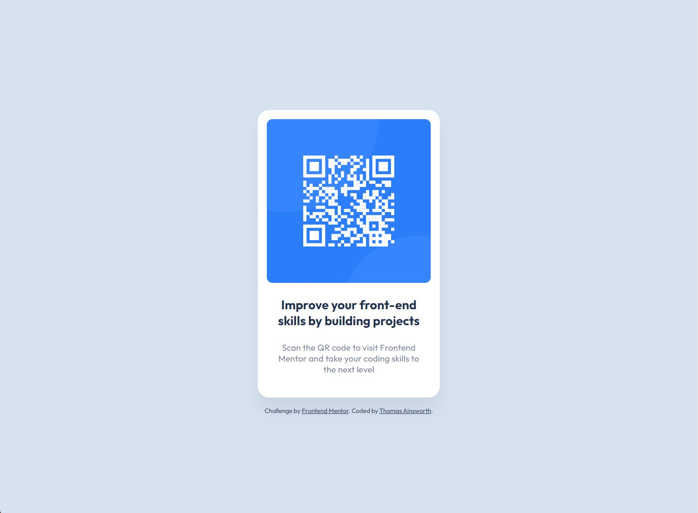

# Frontend Mentor - QR code component solution

This is a solution to the [QR code component challenge on Frontend Mentor](https://www.frontendmentor.io/challenges/qr-code-component-iux_sIO_H). Frontend Mentor challenges help you improve your coding skills by building realistic projects.

## Table of contents

- [Overview](#overview)
  - [Screenshot](#screenshot)
  - [Links](#links)
- [My process](#my-process)
  - [Built with](#built-with)
  - [What I learned](#what-i-learned)
  - [Continued development](#continued-development)
  - [Useful resources](#useful-resources)
- [Author](#author)
- [Acknowledgments](#acknowledgments)

**Note: Delete this note and update the table of contents based on what sections you keep.**

## Overview
This is my first project attempt for Frontend Mentor. I'm excited to get feeback from anyone who is willing to share! The challenge was to build out a QR code component given the design provided. I used Figma to closely inspect elements to narrow down how I should proceed. I think I've got this project fairly close to the intended specs but would love pointers on best practices.
### Screenshot

### Links

- Live Site URL: (https://thomasains23.github.io/)

## My process
I started by identifying the indvidual components of the QR code. While I initially want to wrap everything in a `
`, I ended up coming to the conslusion that I could simply have one `<section>` wrapping ``, `<h2>`, and `
` elements. After some trial and error with flexbox styling, I finally fit these elements into the container per the design. There was a bit of a learning curve trying to figure out Figma for the first time, but I think it was very helpful for this project and I'm excited to keep using it.
### Built with

- (Some) Semantic HTML5 markup
- Flexbox
- CSS Grid

### What I learned

I learned to trust my gut and build out the html the way that makes sense initially. I also learned that just because you kind of remember something from a tutorial doesn't mean you won't have to look it up and refresh on certain subjects.

### Continued development

Pending feedback, I will update accordingly. I also plan to work on the mobile version of the project to expand on what I've learned here.

### Useful resources

- [Figma's Dev Mode](https://www.youtube.com/watch?v=wk9xSDNboZw) - This helped me turn down the noise and focus in on what was important.

## Author

- Website - [Add your name here](https://www.your-site.com)
- Frontend Mentor - [@ThomasAins23](https://www.frontendmentor.io/profile/ThomasAins23)

## Acknowledgments

This video (https://www.youtube.com/watch?v=wk9xSDNboZw) from DesignCourse on YouTube was particularly helpful with styling this project.
